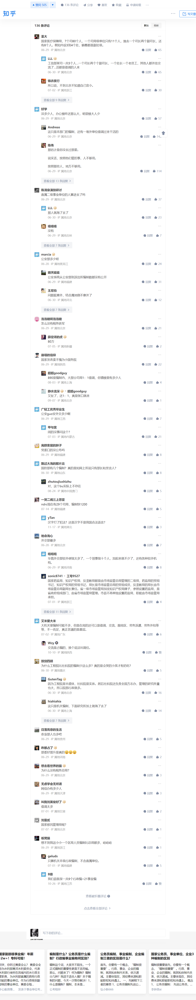

# 文章汇编

[toc]

# 全国公务员总数700多万，为啥基层公务员人手还不够？

>转载自知乎专栏: https://zhuanlan.zhihu.com/p/468134279

目前公务员数量在700万左右，事业单位工作人员数量在3100万左右。也就是说，我国目前广义的公务人员数量为3800万左右。当然不同的统计口径数据可能存在差异，但总体来说，这个数据是比较有代表性的。

听起来人数是很多，但是大家要明白，在我国，公立的大学、中学、小学、甚至幼儿园的教师及工作人员，公立医院的医护人员及工作人员，还有各类科研院所大部分都是事业编制。

如果学校、医院、科研院所等单位都不是事业编制，变为企业当然可以减少公务员数量。但是这样做是否可行呢？这次疫情相信能为大家给出答案。

这次疫情，冲锋在前的是广大的基层公务人员。很多基层干部、医护不眠不休的工作，看起来也让人很心疼，为什么会如此呢？根本原因还是公务人员数量不足。

## 对比凸现公务员缺口巨大

我们做个对比，从可查数据来看，美国联邦政府、州政府及县市政府的全日制雇员和非全日制雇员总数大概为2100万。当然美国2100万公务员也是广义的公务人员。统计口径和我国有区别，但总体相当，具有代表性。

中国公务人员3800万，美国公务人员2100万。咋一看，我国公务人员确实很多啊，整整比灯塔国多了1700万，完全符合很多人中国公务人员太多的刻板印象。

与美国相比较公务员的绝对数量我国多是事实，但是不要忘了，我国大陆人口截至2020年大约为14亿，而美国人口大约为3.3亿。

也就是说我国的公务人员与人口比例为1:36，而美国则为1:15。这表明美国的公务人员的相对数量是我国的2倍多。

还是那句话，我国的公务人员数量远远不足，公务员的扩招是非常合理的。今年的公务员公招，帮助就业是一方面，但更重要的是这次疫情显示出我国公务人员确实人手不足。很多基层工作人员一个人干几个人的工作，公务人员队伍需要补充。所以各位考生应该抓住这次公务员扩招的机会，去充实我们的公务员队伍。为国家的更好发展贡献出自己的力量！

## 基层人员实录

前文的数据分析和对比论证都是比较宏观的。下面笔者就以个人经历证明我国公务人员数量不足的现实。

笔者同事、友人相当大一部分是公务人员。2019年11月，在西部某乡镇工作的公务人员友人向笔者吐槽，工作太忙。他所在的单位编制6人，在编2人，1人别借调到其他单位工作。所以单位科室只剩下他一个人，工作的任务量却还是6个人的，大部分时间都是忙得昏天黑地。同样的，其他几位曾经在基层机关工作过、或正在基层机关工作的友人都反应基层机关的公务人员是严重不足的。

窥一斑可知全豹。也正是基于基层公务人员严重不足的事实，近几年公务人员扩招大量岗位倾向基层单位。

所谓的基层人手不足，其实只是表象，问题的本质是由很多元素构成的，包括但不限于：人员偏少、干活的人少、工作效率低下、为民办事能力不足、官僚风气严重、形式主义严重等等。说白了，这是综合症、并发症。

1. 基层工作人员确实不足。大家不要吐槽我国公务员人员过多，其实在现实工作中，我们明显感觉基层人员非常缺。
举个例子：给农民办社保，一个小镇就算2万人，需要办理社保的按1万人算，工作量就有多少？登记信息、审核材料、整理材料、上报材料，错了再修改信息。如果真有在乡镇工作的人就知道，好多农民连自己身份证号都不知道，名字写不清楚，更不要提那些反感这项福利政策想省点现钱不愿意办社保的了。
再举个例子，大家非常关注的低保。大家都知道，低保是有很多限制条件的，比如说家里不能有新房有车，甚至不能饲养观赏性宠物。而这些信息只能基层工作人员到一线核实。但农村呢，有几个特点，村干部和村民都是本村人，一般不爱得罪人，另外大家平时都各有各的事，不能天天看着他人生活，所以对其他人具体的信息也没法完全知晓，还有一些人会故意隐瞒信息。所以很多时候乡镇工作人员就得来挡住了，但一个乡镇当中，专职负责办理低保的民政办就几个人，面对一个2万人的镇，可能一个个走访、一个个深入核实信息吗？当然不可能。
在我眼里，我国的行政体制是典型的“上大下小”，上级层级太多、人数过剩。比如设区市这一级就为很多人诟病，不少人认为设区市完全没有必要存在。还有很多部门的设置纯属多余。

2. 基层工作人员干活的少。这一点有很多答主已经回答过了，说得非常具体。我只简单地一笔带过。乡镇里的人员格局往往非常有意思，最有冲劲的是两位主官，其次是有发展潜力的副职（通常不多），再次是比较有责任心的副职、普通年轻人和站办所工作人员，其余的都是混日子。我们也经常看到整天无所事事的副职和站长所长，还有得过且过的年轻科员。大概比例就是一半干活一半不干活，一半干活里的人呢，又有一半工作责任心不会很强，大多数人在过了35岁之后，如果没能提拔，就消极怠工了。

3. 工作量大。说到这个，很多人就要吐槽了：你们工作量大个毛线啊？天天看你们在那喝茶啊！老子办点事跑了好几趟啊！工作人员都在聊天啊！

说到这个，我得详细解释一下。实际上乡镇工作很多东西群众是看不到的，比如检查某一块田是否农田改造，如果项目能下来群众还会觉得做了实事，如果乡镇主动争取了却没有争取到呢？之前的各项准备工作就是无用功了，群众就会认为乡镇屁都没干。

另一个更重要的原因我想只有公务员才会明白。所有公共部门的工作都分成对外和对内。所谓对外，就为管理公共事务，或称为民服务，这些事是对老百姓有直接意义的并且能直接看到的。所谓对内，就是内部的组织、管理、协调，这方面老百姓是看不到的，或者看到了也觉得毫无意义。

# 人员编制情况

>转载自知乎专栏: https://zhuanlan.zhihu.com/p/534926914

根据中国机构编制网公开信息整理
1. 国家发展改革委，26个司，行政编890名。
2. 中国社科院，7个局，事业编286名。
3. 中国工程院，5个局，事业编96名。
4. 国务院发展研究中心，10个部，事业编163名。
5. 财政部，24个司，行政编698名。
6. 中国人民银行，23个司，行政编779名。
7. 中国银保监会，27个部，事业编925名。
8. 国家卫健委，23个司，行政编525名。
9. 科技部，17个司，行政编364名。
10. 水利部，22个司，行政编502名。
11. 文旅部，15个司，行政编514名。
12. 海关总署，22个司，行政编847名。
13. 国家市场监管总局，29个司，行政编805名。
14. 国家药品监管局，11个司，行政编216名。
15. 国家知识产权局，9个司，行政编143名。
16. 生态环境部，23个司，行政编478名。
17. 自然资源部，27个司，行政编691名。
18. 全国社保基金理事会，12个部，事业编230名。
19. 国家林草局，17个司，行政编429名。
20. 国家粮食和物资储备局，11个司，行政编205名。
21. 国家医疗保障局，7个司，行政编80名。
22. 国家广播电视总局，15个司，行政编263名。
23. 民政部，13个司，行政编333名。
24. 人力资源和社会保障部，24个司，行政编516名。
25. 国家矿山安全监察局，7个司，行政编100名。
26. 国家文物局，10个司，行政编163名。
27. 国家疾病预防控制局，10个司，行政编170名。
>
